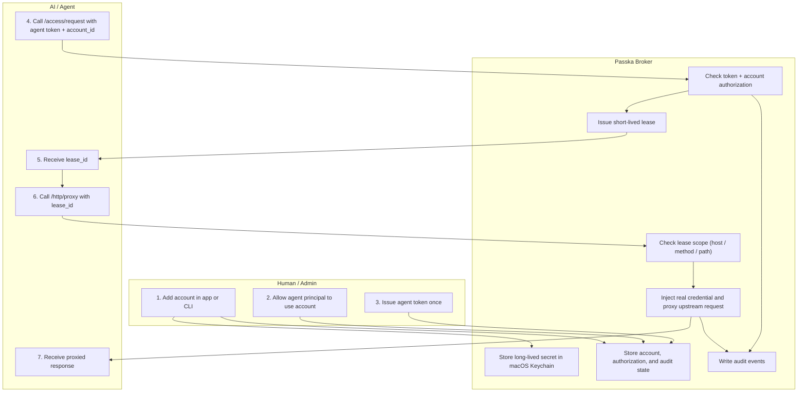

<div align="center">
  <h1>Passka</h1>
  <p><strong>Local credential vault and lease broker for AI agents.</strong></p>
  <p>
    
    
    
    
  </p>
  <p>
    <a href="README.zh-CN.md">中文说明</a>
    · <a href="#quick-start">Quick Start</a>
    · <a href="#http-api">HTTP API</a>
    · <a href="#development">Development</a>
  </p>
</div>

Passka is a local credential broker for AI agents.

You store long-lived credentials once in macOS Keychain. Agents never receive those raw secrets. Instead, an agent authenticates to the local broker with an agent token, asks for a short-lived lease, and then uses that lease through Passka's HTTP proxy.

If an upstream key leaks, you rotate the credential inside Passka and keep the agent integration unchanged.

## Core Model

| Concept | Meaning |
| --- | --- |
| Credential Account | A stored credential such as an API key, OAuth app, OTP seed, or opaque secret bundle. |
| Agent | A local AI tool or automation that is allowed to use an account. |
| Agent Token | A local broker-issued token that authenticates one agent principal to the daemon. |
| Lease | A short-lived access ticket issued for one account and scoped to specific upstream targets. |
| Proxy | The broker sends the upstream request after checking the lease scope and can replace primary placeholders before forwarding. |
| Audit | A record of authorizations, token issuance/revocation, denials, proxy requests, and refreshes. |

## Why This Exists

Without a broker, AI tools often get raw API keys through environment variables or copied secrets. That is convenient, but fragile.

Passka keeps the safer parts local:

1. You add a credential through the macOS app or CLI.
2. The secret is stored in macOS Keychain under `passka-broker`.
3. You authorize a local agent to use that account.
4. You issue an agent token for that local agent principal.
5. The agent uses that token to request a short-lived lease for the account.
6. The agent uses the lease through Passka's proxy.
7. Passka records what happened in the audit log.

## Security Boundaries

- Long-lived secrets stay in macOS Keychain.
- Broker state lives in `~/.config/passka/broker/state.json`.
- CLI admin commands add, list, show metadata, authorize, issue/revoke agent tokens, and inspect audit history.
- CLI agent commands (`request` and `proxy`) go through the local daemon instead of talking to broker state directly.
- There is no secret reveal surface in the CLI, app, or daemon.
- The default daemon is agent-only: it accepts authenticated agent requests, not general admin traffic.
- Leases are scoped to allowed hosts, methods, and path prefixes. If you do not specify host or path scope explicitly, Passka derives defaults from `account.base_url` when possible.
- Agents receive leases and proxied results, not raw API keys or refresh tokens.

## One Model

Passka now has one primary flow:

1. Register an account.
2. Allow an agent principal to use that account.
3. Issue an agent token for that principal.
4. Let the agent request a lease and proxy upstream requests with that lease.

Administrative work stays on the CLI. Agent traffic goes through the daemon.



## Install

GitHub Releases publish architecture-specific macOS artifacts for both the CLI and the desktop app:

- `passka-cli-<version>-macos-x86_64.tar.gz`
- `passka-cli-<version>-macos-arm64.tar.gz`
- `Passka-<version>-macos-x86_64.zip`
- `Passka-<version>-macos-arm64.zip`

Choose the archive that matches your Mac.

Install the CLI:

```bash
tar -xzf passka-cli-<version>-macos-<arch>.tar.gz
mkdir -p "$HOME/.local/bin"
mv passka "$HOME/.local/bin/passka"
chmod +x "$HOME/.local/bin/passka"
```

If `~/.local/bin` is not already on your `PATH`, add this line to `~/.zshrc`:

```bash
export PATH="$HOME/.local/bin:$PATH"
```

Install the macOS app:

1. Unzip `Passka-<version>-macos-<arch>.zip`
2. Drag `Passka.app` into `/Applications`
3. Right-click `Passka.app` and choose `Open` the first time if macOS warns that the app is unsigned

Release artifacts are currently unsigned and not notarized, so the first launch needs an explicit `Open` confirmation.

## Quick Start

Assume the default agent principal `principal:local-agent`.

1. Start the daemon

```bash
cargo run -p passka-cli -- broker serve --addr 127.0.0.1:8478
```

2. Register one account, allow that agent, and issue one agent token

```bash
cargo run -p passka-cli -- account add openai-prod \
  --provider openai \
  --auth api_key \
  --base-url https://api.openai.com

cargo run -p passka-cli -- account allow <account_id> \
  --agent principal:local-agent \
  --allow-host api.openai.com \
  --allow-method GET,POST \
  --allow-path-prefix /v1 \
  --lease-seconds 300

cargo run -p passka-cli -- principal token issue principal:local-agent
```

The token command prints JSON containing `agent_token`. Passka only returns the plaintext token at issuance time.

3. Request a lease, then proxy through Passka

```bash
cargo run -p passka-cli -- request \
  --account <account_id> \
  --agent-token <agent_token>

cargo run -p passka-cli -- proxy \
  --lease <lease_id> \
  --agent-token <agent_token> \
  --method GET \
  --path https://api.openai.com/v1/models
```

## Supported Credential Types

Passka stores several credential shapes under the same account model:

- `api_key`: API key plus auth header metadata
- `oauth`: authorize locally, refresh locally, proxy without exposing refresh tokens
- `otp`: store a TOTP seed locally
- `opaque`: arbitrary key-value secret bundles

These are storage types, not separate product concepts.

## HTTP Proxy

The agent sends the upstream request to Passka, and Passka injects the real credential locally.

Direct proxy request:

```bash
curl -s http://127.0.0.1:8478/http/proxy \
  -H 'authorization: Bearer <agent_token>' \
  -H 'content-type: application/json' \
  -d '{
    "lease_id": "<lease_id>",
    "request": {
      "method": "GET",
      "path": "https://api.openai.com/v1/models"
    }
  }'
```

Forward proxy request:

```bash
curl -x http://127.0.0.1:8478 \
  --proxy-header "X-Passka-Agent-Token: <agent_token>" \
  --proxy-header "X-Passka-Lease: <lease_id>" \
  https://api.openai.com/v1/models
```

### Placeholder Replacement

Passka can replace placeholders in forwarded headers and UTF-8 text bodies before sending the upstream request.

- `PASSKA_API_KEY` for API key accounts
- `PASSKA_TOKEN` for OAuth accounts

This replacement uses only the primary proxied account for the lease. It does not reintroduce multi-lease alias expansion.

Minimal example:

```bash
curl -s http://127.0.0.1:8478/http/proxy \
  -H 'authorization: Bearer <agent_token>' \
  -H 'content-type: application/json' \
  -d '{
    "lease_id": "<lease_id>",
    "request": {
      "method": "POST",
      "path": "https://api.openai.com/v1/responses",
      "headers": {
        "x-debug-key": "PASSKA_API_KEY"
      },
      "body": "{\"api_key\":\"PASSKA_API_KEY\"}"
    }
  }'
```

## Lease Scope

Passka now snapshots target constraints into each lease.

- Configure scope at authorization time with `account allow`.
- `--allow-host` accepts hostnames or `host:port` values.
- `--allow-method` accepts a comma-separated list such as `GET,POST`.
- `--allow-path-prefix` accepts one or more path prefixes such as `/v1/models`.
- If `--allow-host` is omitted and the account has a `base_url`, Passka derives the default host scope from that `base_url`.
- If `--allow-path-prefix` is omitted and the account `base_url` contains a path prefix such as `https://api.example.com/v1`, Passka derives `/v1` as the default path scope.
- If neither explicit host scope nor `base_url` is available, the lease can still be issued, but proxy use will be denied because there is no target host boundary to enforce.

## macOS App

The macOS app is the human-facing credential manager:

- Browse stored credential accounts
- Add API key, OAuth, OTP, and opaque accounts
- Register agent principals
- Inspect recent audit activity for an account

Build it with:

```bash
cd app && swift build
```

## HTTP API

The local daemon exposed by `passka broker serve` is now the default agent plane for agents and MCP bridges.

```text
GET    /health
POST   /access/request
POST   /http/proxy
```

Notes:

- JSON API requests must include `Authorization: Bearer <agent_token>`.
- Forward proxy requests must include `X-Passka-Agent-Token: <agent_token>`.
- `/access/request` takes `account_id` plus optional `context`; the daemon derives the principal from the authenticated token.
- Proxy execution enforces the scoped lease snapshot on every request.
- Administrative actions such as account registration, authorization, OAuth completion, and audit inspection stay on the CLI/admin side.

## Development

Build the Rust workspace:

```bash
cargo build
```

Run the Rust tests:

```bash
cargo test --workspace
```

Build the macOS app:

```bash
cd app && swift build
```

Create a GitHub release by pushing a semver tag such as `v0.1.0`. The release workflow builds macOS Intel and Apple Silicon artifacts, packages the CLI and desktop app, and uploads them to the GitHub Release with a `SHA256SUMS.txt` file.
