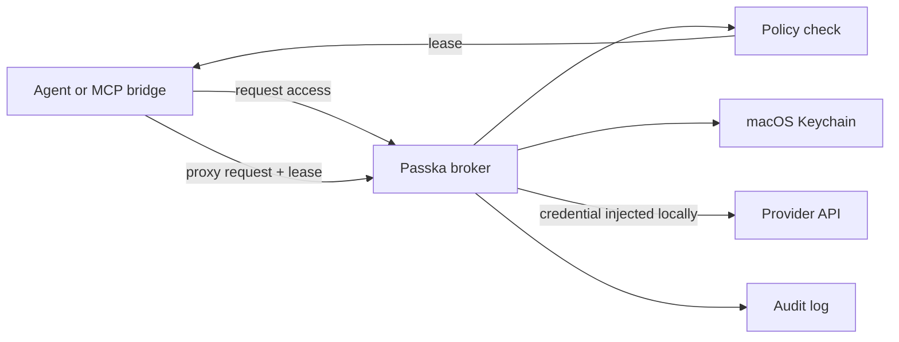

<div align="center">
  <h1>Passka</h1>
  <p><strong>Local auth broker for AI agents.</strong></p>
  <p>
    
    
    
    
  </p>
  <p>
    <a href="README.zh-CN.md">中文说明</a>
    · <a href="#quick-start">Quick Start</a>
    · <a href="#using-the-proxy">Proxy</a>
    · <a href="#development">Development</a>
  </p>
</div>

Passka lets an agent use OpenAI, GitHub, Slack, Feishu, or any HTTP API without handing it your long-lived API keys or OAuth refresh tokens. Credentials stay on your machine, policies decide what an agent can do, and every grant or proxy request lands in an audit log.

> Agents ask for a capability, not a secret.

## Highlights

| Capability | What it gives you |
| --- | --- |
| Broker-first auth | Agents request short-lived leases instead of raw credentials. |
| Two proxy paths | Use the JSON `/http/proxy` endpoint or point HTTP proxy traffic at the broker. |
| Local secret storage | Long-lived provider material stays in macOS Keychain under `passka-broker`. |
| Policy and audit | Grants, denials, proxy requests, refreshes, and reveals are recorded. |
| OAuth-ready | OAuth accounts can authorize once, refresh locally, and proxy without exposing tokens. |

## Why Use It

AI agents often need to call real services. The unsafe version is simple: put API keys in environment variables and hope nothing prints or leaks them. Passka aims for a safer flow:

1. You add a provider account, such as OpenAI or GitHub.
2. You create a policy that says which local agent can access which resource.
3. The agent asks Passka for access to that resource.
4. Passka grants a short-lived lease if the policy allows it.
5. Passka proxies the request, so the long-lived credential stays local.
6. Passka records what happened in the audit log.

## What Passka Protects

- Long-lived provider material is stored in macOS Keychain under service `passka-broker`.
- Broker state, policies, leases, and audit logs live in `~/.config/passka/broker/state.json`.
- Agents receive access leases and proxied results, not API keys or refresh tokens.
- Human reveal in the macOS app requires local biometric/device authentication.

## How It Works



## Quick Start

Run the local broker:

```bash
cargo run -p passka-cli -- broker serve --addr 127.0.0.1:8478
```

Check that it is alive:

```bash
curl http://127.0.0.1:8478/health
```

Add a provider account:

```bash
cargo run -p passka-cli -- account add openai-prod \
  --provider openai \
  --auth api_key \
  --base-url https://api.openai.com
```

Allow the default local agent to read OpenAI model resources:

```bash
cargo run -p passka-cli -- policy allow \
  --principal principal:local-agent \
  --account <account_id> \
  --resource openai/models/* \
  --actions read \
  --lease-seconds 300
```

Ask for a short-lived lease:

```bash
cargo run -p passka-cli -- request \
  --principal principal:local-agent \
  --resource openai/models/gpt-4.1 \
  --action read \
  --environment local \
  --purpose "model discovery"
```

Use that lease with the direct proxy endpoint:

```bash
cargo run -p passka-cli -- proxy \
  --lease <lease_id> \
  --method GET \
  --path https://api.openai.com/v1/models
```

Or use the broker as a plain HTTP forward proxy:

```bash
curl -x http://127.0.0.1:8478 \
  --proxy-header "X-Passka-Lease: <lease_id>" \
  -H "Authorization: Bearer PASSKA_API_KEY" \
  https://api.openai.com/v1/models
```

Passka replaces `PASSKA_API_KEY` / `PASSKA_TOKEN` placeholders in forwarded headers and text bodies before sending the upstream request. It also injects the configured provider auth header, so most callers can omit the auth header entirely.

For requests that need credentials from more than one service, request one lease per account and bind the extra leases to aliases:

```bash
cargo run -p passka-cli -- proxy \
  --lease <openai_lease_id> \
  --extra-lease github=<github_lease_id> \
  --method POST \
  --path https://api.example.test/composite \
  --body '{"openai":"PASSKA_API_KEY","github":"PASSKA_GITHUB_API_KEY","github_account":"PASSKA_GITHUB_ACCOUNT_ID"}'
```

See what happened:

```bash
cargo run -p passka-cli -- audit list --limit 20
```

## OAuth Accounts

For OAuth providers, add the account and then complete the browser-based authorization flow:

```bash
cargo run -p passka-cli -- account add slack-workspace \
  --provider slack \
  --auth oauth \
  --base-url https://slack.com/api

cargo run -p passka-cli -- auth <account_id>
```

Passka stores and refreshes OAuth material locally. Agents still request leases and proxy requests; they do not receive refresh tokens.

## OTP Accounts

Passka can also store TOTP seeds and generate current one-time codes through the broker reveal path:

```bash
cargo run -p passka-cli -- account add github-otp \
  --provider github \
  --auth otp

cargo run -p passka-cli -- account reveal <account_id> --field code --raw
```

The OTP seed remains in macOS Keychain. Revealing `code` or `seed` is audited and follows the same human reveal rules as other sensitive fields.

## macOS App

The macOS app is a broker console:

- Browse provider accounts by provider.
- Add API key, OAuth, OTP, and opaque provider accounts.
- Reveal sensitive fields only after local authentication.
- Inspect recent audit history for an account.

Build it with:

```bash
cd app && swift build
```

## Concepts

| Term | Plain meaning |
| --- | --- |
| Principal | Who is asking. Usually a local human or local agent. |
| Provider account | The external account Passka can use, such as an OpenAI or GitHub account. |
| Policy | The rule that says who can use which provider account for which resources. |
| Resource | The thing being accessed, such as `openai/models/*`. |
| Lease | A short-lived approval to do one kind of action. |
| Proxy | Passka making the HTTP request while keeping the secret hidden. |
| Audit event | A record of a grant, denial, reveal, refresh, or proxied request. |

## HTTP API

Agents and MCP bridges can use the local JSON API exposed by `passka broker serve`:

```text
GET    /health
GET    /principals
POST   /principals
GET    /accounts
POST   /accounts
GET    /accounts/{account_id}
DELETE /accounts/{account_id}
POST   /accounts/{account_id}/reveal
GET    /policies
POST   /policies/allow
GET    /audit?limit=20
POST   /access/request
POST   /http/proxy
POST   /oauth/{account_id}/start
POST   /oauth/{account_id}/complete
POST   /oauth/{account_id}/refresh
```

## Using The Proxy

Passka supports two proxy styles.

### 1. Direct proxy endpoint

Use this when your agent or MCP bridge can call Passka's JSON API directly. The agent sends the target request as JSON, and Passka forwards it with the provider credential kept local.

Request a lease:

```bash
curl -s http://127.0.0.1:8478/access/request \
  -H 'content-type: application/json' \
  -d '{
    "principal_id": "principal:local-agent",
    "resource": "openai/models/gpt-4.1",
    "action": "read",
    "context": {
      "environment": "local",
      "purpose": "model discovery",
      "source": "mcp"
    }
  }'
```

Then send a proxied request:

```bash
curl -s http://127.0.0.1:8478/http/proxy \
  -H 'content-type: application/json' \
  -d '{
    "lease_id": "<lease_id>",
    "request": {
      "method": "GET",
      "path": "https://api.openai.com/v1/models",
      "headers": {
        "X-Debug-Token": "PASSKA_API_KEY"
      }
    }
  }'
```

Use an absolute `http(s)` URL for direct proxy calls. A provider-relative path such as `/v1/models` only works when the provider account has a `base_url` configured.

Need more than one provider credential in the same request? Request a lease for each provider account, then pass the primary lease as `lease_id` and bind the others under `extra_leases`:

```bash
curl -s http://127.0.0.1:8478/http/proxy \
  -H 'content-type: application/json' \
  -d '{
    "lease_id": "<openai_lease_id>",
    "extra_leases": {
      "github": "<github_lease_id>",
      "slack": "<slack_lease_id>"
    },
    "request": {
      "method": "POST",
      "path": "https://api.example.test/composite",
      "body": "{\"openai\":\"PASSKA_API_KEY\",\"github\":\"PASSKA_GITHUB_API_KEY\",\"github_account\":\"PASSKA_GITHUB_ACCOUNT_ID\",\"slack\":\"PASSKA_SLACK_TOKEN\"}"
    }
  }'
```

The primary lease still decides which provider account is injected as the upstream HTTP auth header. Extra leases are only used for placeholder replacement, and each lease must belong to the same principal.

### 2. Plain HTTP forward proxy

Use this when a client already supports an HTTP proxy setting. Point the client at `http://127.0.0.1:8478`, then pass the lease in one of these headers:

- `X-Passka-Lease: <lease_id>`
- `Proxy-Authorization: Bearer <lease_id>`

Example with curl proxy mode:

```bash
curl -x http://127.0.0.1:8478 \
  --proxy-header "X-Passka-Lease: <lease_id>" \
  https://api.openai.com/v1/models
```

Example without curl proxy mode:

```bash
curl -s http://127.0.0.1:8478/ \
  -H "X-Passka-Lease: <lease_id>" \
  -H "X-Passka-Target: https://api.openai.com/v1/models" \
  -H "Authorization: Bearer PASSKA_API_KEY"
```

For extra leases in forward-proxy mode, use a comma-separated header:

```bash
curl -s http://127.0.0.1:8478/ \
  -H "X-Passka-Lease: <openai_lease_id>" \
  -H "X-Passka-Extra-Leases: github=<github_lease_id>,slack=<slack_lease_id>" \
  -H "X-Passka-Target: https://api.example.test/composite" \
  -d '{"github":"PASSKA_GITHUB_API_KEY","slack":"PASSKA_SLACK_TOKEN"}'
```

Passka replaces `PASSKA_API_KEY`, `$PASSKA_API_KEY`, `{{PASSKA_API_KEY}}`, `PASSKA_TOKEN`, `$PASSKA_TOKEN`, and `{{PASSKA_TOKEN}}` with the primary lease credential. Extra lease aliases become uppercase placeholder prefixes:

| Alias binding | Example placeholders |
| --- | --- |
| `github=<lease>` | `PASSKA_GITHUB_API_KEY`, `PASSKA_GITHUB_ACCOUNT_ID`, `PASSKA_GITHUB_ACCOUNT_NAME`, `PASSKA_GITHUB_PROVIDER` |
| `slack=<lease>` | `PASSKA_SLACK_TOKEN`, `PASSKA_SLACK_ACCESS_TOKEN`, `PASSKA_SLACK_BASE_URL` |

Standard HTTPS `CONNECT` tunnels are encrypted, so Passka does not rewrite inside them unless a future TLS interception/CA setup is added.

## Useful Commands

```bash
cargo run -p passka-cli -- principal list
cargo run -p passka-cli -- principal add <name> --kind agent

cargo run -p passka-cli -- account list
cargo run -p passka-cli -- account show <account_id>
cargo run -p passka-cli -- account reveal <account_id> --field api_key
cargo run -p passka-cli -- account reveal <account_id> --field code --raw
cargo run -p passka-cli -- account remove <account_id>

cargo run -p passka-cli -- policy list
cargo run -p passka-cli -- policy allow --principal <principal_id> --account <account_id> --resource <pattern> --actions read

cargo run -p passka-cli -- request --principal <principal_id> --resource <resource> --action <action>
cargo run -p passka-cli -- proxy --lease <lease_id> --method GET --path https://api.example.test/path
cargo run -p passka-cli -- proxy --lease <lease_id> --extra-lease github=<lease_id> --method POST --path https://api.example.test/path --body '{"github":"PASSKA_GITHUB_API_KEY"}'

cargo run -p passka-cli -- audit list --limit 20
cargo run -p passka-cli -- broker serve
```

## Development

```bash
cargo build
cargo test --workspace
cd app && swift build
```
