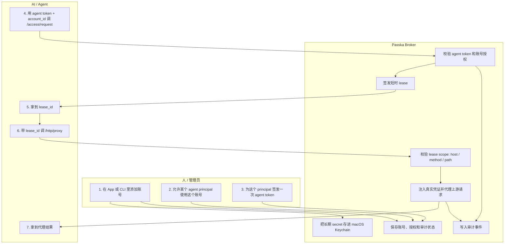

<div align="center">
  <h1>Passka</h1>
  <p><strong>给 AI Agent 用的本地凭证库与 Lease Broker。</strong></p>
  <p>
    
    
    
    
  </p>
  <p>
    <a href="README.md">English</a>
    · <a href="#快速开始">快速开始</a>
    · <a href="#http-api">HTTP API</a>
    · <a href="#开发">开发</a>
  </p>
</div>

Passka 的定位很简单：它是一个给 AI agent 用的本地凭证 Broker。

用户把长期凭证保存在本机的 macOS Keychain 里。AI 不会直接拿到这些明文凭证，而是先用 agent token 向本地 broker 做身份认证，申请一个短时 `Lease`，再通过 Passka 的 HTTP 代理访问上游服务。

如果上游密钥泄露，你只需要在 Passka 里轮换凭证，不需要改 AI 侧的接入方式。

## 核心模型

| 概念 | 含义 |
| --- | --- |
| Credential Account | 一份已保存的凭证账号，可以是 API Key、OAuth、OTP 或 opaque secret。 |
| Agent | 被允许使用某个账号的本地 AI 工具或自动化。 |
| Agent Token | broker 本地签发给某个 agent principal 的认证 token。 |
| Lease | 某个账号的短时访问票据，并且会绑定目标范围。 |
| Proxy | broker 在校验 lease scope 后代你发上游请求，也可以在转发前替换主凭证占位符。 |
| Audit | 对账号授权、token 签发/撤销、拒绝、代理与刷新等行为的审计记录。 |

## 为什么这样设计

如果不给 Broker，最常见的做法就是把 API Key 放进环境变量或者直接复制给 AI。这样虽然方便，但边界很脆弱。

Passka 把风险尽量留在本机：

1. 你通过 macOS App 或 CLI 添加一个凭证账号。
2. 长期 secret 存进 macOS Keychain。
3. 你授权某个本地 agent 可以使用这个账号。
4. 你为本地 agent principal 签发一个 agent token。
5. agent 用这个 token 为该账号申请一个短期 lease。
6. agent 带着 lease 走 Passka 的代理。
7. Passka 把过程写进审计日志。

## 安全边界

- 长期凭证保存在 macOS Keychain，服务名是 `passka-broker`。
- Broker 状态保存在 `~/.config/passka/broker/state.json`。
- CLI 的 admin 命令可以添加、列出、查看元数据、授权账号、签发/撤销 agent token、查看审计。
- CLI 的 agent 命令（`request` / `proxy`）现在通过本地 daemon，而不是直接触达 broker 状态。
- CLI、App 和 daemon 都不提供明文 secret reveal。
- 默认 daemon 现在只暴露 agent plane，不再承担通用 admin API。
- lease 现在会绑定允许访问的 host / method / path prefix；如果没有显式配置 host 或 path，Passka 会尽量从 `account.base_url` 推导默认范围。
- AI 拿到的是 lease 和代理结果，不是原始 API Key 或 refresh token。

## 一条主路径

Passka 现在只有一条主路径：

1. 注册一个账号。
2. 允许某个 agent principal 使用这个账号。
3. 为该 principal 签发 agent token。
4. 让 agent 用 token 申请 lease，再带着 lease 走代理。

管理动作留在 CLI，agent 流量走 daemon。



## 安装

GitHub Releases 会发布按架构区分的 macOS 制品，分别给 CLI 和桌面 App 使用：

- `passka-cli-<version>-macos-x86_64.tar.gz`
- `passka-cli-<version>-macos-arm64.tar.gz`
- `Passka-<version>-macos-x86_64.zip`
- `Passka-<version>-macos-arm64.zip`

请按你的 Mac 架构选择对应文件。

安装 CLI：

```bash
tar -xzf passka-cli-<version>-macos-<arch>.tar.gz
mkdir -p "$HOME/.local/bin"
mv passka "$HOME/.local/bin/passka"
chmod +x "$HOME/.local/bin/passka"
```

如果 `~/.local/bin` 还没加到 `PATH`，可以在 `~/.zshrc` 里加入：

```bash
export PATH="$HOME/.local/bin:$PATH"
```

安装 macOS App：

1. 解压 `Passka-<version>-macos-<arch>.zip`
2. 把 `Passka.app` 拖到 `/Applications`
3. 第一次打开如果被 macOS 提示“未签名”，右键应用并选择 `Open`

当前 release 制品还没有签名和 notarize，所以首次启动需要手动确认一次 `Open`。

## 快速开始

默认使用内置 agent principal：`principal:local-agent`。

1. 启动 daemon

```bash
cargo run -p passka-cli -- broker serve
```

Passka 会先尝试 `127.0.0.1:8478`。如果这个端口已经被占用，它会自动切到一个空闲本地端口，并打印出实际的 broker URL。
CLI 的 agent 命令会自动发现最近一次启动的 daemon；如果你想手动覆盖，可以传 `--broker-url <url>`，或者设置 `PASSKA_BROKER_URL`。

2. 注册一个账号，允许这个 agent 使用它，再签发一个 agent token

```bash
cargo run -p passka-cli -- account add openai-prod \
  --provider openai \
  --auth api_key \
  --base-url https://api.openai.com

cargo run -p passka-cli -- account allow <account_id> \
  --agent principal:local-agent \
  --allow-host api.openai.com \
  --allow-method GET,POST \
  --allow-path-prefix /v1 \
  --lease-seconds 300

cargo run -p passka-cli -- principal token issue principal:local-agent
```

这个命令会输出包含 `agent_token` 的 JSON。明文 token 只会在签发时返回一次。

3. 申请 lease，然后通过 Passka 代理访问

```bash
cargo run -p passka-cli -- request \
  --account <account_id> \
  --agent-token <agent_token>

cargo run -p passka-cli -- proxy \
  --lease <lease_id> \
  --agent-token <agent_token> \
  --method GET \
  --path https://api.openai.com/v1/models
```

## 支持的凭证类型

Passka 用统一的“账号”模型承载不同类型的凭证：

- `api_key`：API Key 加认证 header 元数据
- `oauth`：本地完成授权、本地刷新，但不会把 refresh token 给 agent
- `otp`：本地保存 TOTP seed
- `opaque`：任意 key-value secret 集合

这些只是凭证类型，不是不同的产品架构。

## HTTP 代理

agent 把目标请求发给 Passka，Passka 在本地注入真实凭证后再发给上游。

直接代理接口：

```bash
curl -s <broker_url>/http/proxy \
  -H 'authorization: Bearer <agent_token>' \
  -H 'content-type: application/json' \
  -d '{
    "lease_id": "<lease_id>",
    "request": {
      "method": "GET",
      "path": "https://api.openai.com/v1/models"
    }
  }'
```

普通 forward proxy：

```bash
curl -x <broker_url> \
  --proxy-header "X-Passka-Agent-Token: <agent_token>" \
  --proxy-header "X-Passka-Lease: <lease_id>" \
  https://api.openai.com/v1/models
```

### 代理时做占位符替换

Passka 可以在转发前，替换 header 和 UTF-8 文本 body 里的主凭证占位符。

- `PASSKA_API_KEY` 适用于 API key 账号
- `PASSKA_TOKEN` 适用于 OAuth 账号

这项能力只使用当前 lease 对应的主账号，不会重新引入多 lease alias 扩展。

最小示例：

```bash
curl -s <broker_url>/http/proxy \
  -H 'authorization: Bearer <agent_token>' \
  -H 'content-type: application/json' \
  -d '{
    "lease_id": "<lease_id>",
    "request": {
      "method": "POST",
      "path": "https://api.openai.com/v1/responses",
      "headers": {
        "x-debug-key": "PASSKA_API_KEY"
      },
      "body": "{\"api_key\":\"PASSKA_API_KEY\"}"
    }
  }'
```

## Lease Scope

现在每个 lease 都会把目标约束快照进去。

- 作用域在 `account allow` 时配置。
- `--allow-host` 支持 hostname，也支持 `host:port`。
- `--allow-method` 支持逗号分隔，例如 `GET,POST`。
- `--allow-path-prefix` 支持一个或多个路径前缀，例如 `/v1/models`。
- 如果不显式传 `--allow-host`，且账号有 `base_url`，Passka 会自动从 `base_url` 推导默认 host scope。
- 如果不显式传 `--allow-path-prefix`，且 `base_url` 自带路径，例如 `https://api.example.com/v1`，Passka 会自动推导 `/v1` 作为默认 path scope。
- 如果既没有显式 host scope，也没有 `base_url` 可推导，lease 依然可以签发，但 proxy 阶段会拒绝使用，因为 broker 无法约束目标主机边界。

## macOS App

macOS App 是给人类使用的凭证管理前台：

- 浏览已保存的凭证账号
- 添加 API Key、OAuth、OTP 和 opaque 账号
- 注册 agent principal
- 查看某个账号最近的审计活动

构建命令：

```bash
cd app && swift build
```

## HTTP API

`passka broker serve` 现在默认只作为 agent plane，供 agent 和 MCP bridge 使用：

```text
GET    /health
POST   /access/request
POST   /http/proxy
```

说明：

- JSON API 请求必须带 `Authorization: Bearer <agent_token>`。
- forward proxy 请求必须带 `X-Passka-Agent-Token: <agent_token>`。
- `/access/request` 只接收 `account_id` 和可选 `context`；principal 由 daemon 从 token 推导。
- proxy 执行时会对请求使用的 lease 做 scope 校验。
- 账号注册、授权、OAuth 完成、审计查看等管理动作保留在 CLI/admin 侧。
- `passka request` 和 `passka proxy` 会自动发现最近一次启动的 daemon，所以 daemon 换端口后 CLI 仍然能继续工作。
- 如果你是直接用 `curl` 这类原始 HTTP 工具，请使用 `passka broker serve` 打印出来的 broker URL。

## 开发

构建 Rust workspace：

```bash
cargo build
```

运行 Rust 测试：

```bash
cargo test --workspace
```

构建 macOS App：

```bash
cd app && swift build
```

发布 GitHub Release 的方式也很简单：推送一个类似 `v0.1.0` 的语义化版本 tag。release workflow 会分别构建 macOS Intel 和 Apple Silicon 制品，打包 CLI 与桌面 App，并把它们连同 `SHA256SUMS.txt` 一起上传到 GitHub Release。
