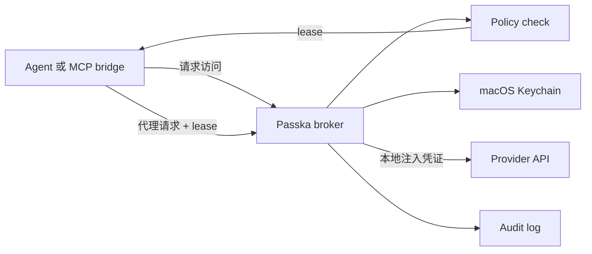

<div align="center">
  <h1>Passka</h1>
  <p><strong>给 AI Agent 使用的本地 Auth Broker。</strong></p>
  <p>
    
    
    
    
  </p>
  <p>
    <a href="README.md">English README</a>
    · <a href="#快速开始">快速开始</a>
    · <a href="#使用代理">使用代理</a>
    · <a href="#开发">开发</a>
  </p>
</div>

Passka 让 Agent 可以使用 OpenAI、GitHub、Slack、飞书，或者任意 HTTP API，但不需要把长期 API Key、OAuth refresh token 交给 Agent。真正的凭证留在你的机器上，policy 决定 Agent 能做什么，授权和代理请求都会进入 audit log。

> Agent 请求的是“能力”，不是“密钥”。

## 亮点

| 能力 | 带来的效果 |
| --- | --- |
| Broker-first auth | Agent 请求短期 lease，而不是拿到原始凭证。 |
| 两种代理方式 | 可以调用 JSON `/http/proxy`，也可以把普通 HTTP proxy 流量打到 broker。 |
| 本地密钥存储 | 长期 provider 授权材料保存在 macOS Keychain 的 `passka-broker` service 下。 |
| Policy 和 audit | 授权、拒绝、代理请求、刷新、敏感字段查看都会被记录。 |
| OAuth-ready | OAuth 账号授权一次后，本地刷新 token，代理请求时不暴露 token。 |

## 为什么需要它

AI Agent 经常需要调用真实服务。最简单但也最危险的做法，是把 API Key 放进环境变量里，然后祈祷它不会被打印、记录或泄露。Passka 想提供一个更安全的流程：

1. 你添加一个 provider account，比如 OpenAI 或 GitHub。
2. 你创建一条 policy，说明哪个本地 Agent 可以访问哪个资源。
3. Agent 向 Passka 请求访问这个资源。
4. 如果 policy 允许，Passka 发放一个短期 lease。
5. Passka 代理请求，所以长期凭证始终留在本地。
6. Passka 把发生过的授权、拒绝、代理请求和敏感字段查看记录到 audit log。

## Passka 保护什么

- 长期 provider 授权材料存放在 macOS Keychain，service 为 `passka-broker`。
- Broker 状态、policy、lease、audit log 存放在 `~/.config/passka/broker/state.json`。
- Agent 拿到的是 access lease 和代理请求结果，不是 API Key 或 refresh token。
- macOS App 里查看敏感字段需要本地生物识别或设备认证。

## 工作方式



## 快速开始

启动本地 broker：

```bash
cargo run -p passka-cli -- broker serve --addr 127.0.0.1:8478
```

检查服务是否启动：

```bash
curl http://127.0.0.1:8478/health
```

添加一个 provider account：

```bash
cargo run -p passka-cli -- account add openai-prod \
  --provider openai \
  --auth api_key \
  --base-url https://api.openai.com
```

允许默认本地 Agent 读取 OpenAI 模型资源：

```bash
cargo run -p passka-cli -- policy allow \
  --principal principal:local-agent \
  --account <account_id> \
  --resource openai/models/* \
  --actions read \
  --lease-seconds 300
```

请求一个短期 lease：

```bash
cargo run -p passka-cli -- request \
  --principal principal:local-agent \
  --resource openai/models/gpt-4.1 \
  --action read \
  --environment local \
  --purpose "model discovery"
```

用这个 lease 调用直接代理接口：

```bash
cargo run -p passka-cli -- proxy \
  --lease <lease_id> \
  --method GET \
  --path https://api.openai.com/v1/models
```

或者把 broker 当成普通 HTTP forward proxy 使用：

```bash
curl -x http://127.0.0.1:8478 \
  --proxy-header "X-Passka-Lease: <lease_id>" \
  -H "Authorization: Bearer PASSKA_API_KEY" \
  https://api.openai.com/v1/models
```

Passka 会在转发前替换 header 和文本 body 里的 `PASSKA_API_KEY` / `PASSKA_TOKEN` 占位符。它也会自动注入 provider account 里配置的认证 header，所以多数调用方可以完全不传认证 header。

如果一个请求需要多个服务的凭证，先给每个 provider account 各请求一个 lease，然后把额外 lease 绑定到 alias：

```bash
cargo run -p passka-cli -- proxy \
  --lease <openai_lease_id> \
  --extra-lease github=<github_lease_id> \
  --method POST \
  --path https://api.example.test/composite \
  --body '{"openai":"PASSKA_API_KEY","github":"PASSKA_GITHUB_API_KEY","github_account":"PASSKA_GITHUB_ACCOUNT_ID"}'
```

查看 audit log：

```bash
cargo run -p passka-cli -- audit list --limit 20
```

## OAuth 账号

OAuth provider 需要先添加账号，再完成浏览器授权流程：

```bash
cargo run -p passka-cli -- account add slack-workspace \
  --provider slack \
  --auth oauth \
  --base-url https://slack.com/api

cargo run -p passka-cli -- auth <account_id>
```

Passka 会在本地保存和刷新 OAuth 授权材料。Agent 仍然通过 lease 和 proxy 访问服务，不会拿到 refresh token。

## macOS App

macOS App 是一个 broker 控制台：

- 按 provider 浏览账号。
- 添加 API Key、OAuth 和 opaque provider account。
- 通过本地认证后查看敏感字段。
- 查看账号最近的 audit history。

构建方式：

```bash
cd app && swift build
```

## 核心概念

| 术语 | 含义 |
| --- | --- |
| Principal | 谁在请求。通常是本地用户或本地 Agent。 |
| Provider account | Passka 可以使用的外部账号，比如 OpenAI 或 GitHub。 |
| Policy | 规则：谁可以使用哪个 provider account 访问哪些资源。 |
| Resource | 被访问的东西，比如 `openai/models/*`。 |
| Lease | 一次短期批准，用来执行某类动作。 |
| Proxy | Passka 代发 HTTP 请求，同时隐藏真实凭证。 |
| Audit event | 授权、拒绝、查看、刷新、代理请求等事件记录。 |

## HTTP API

Agent 和 MCP bridge 可以使用 `passka broker serve` 暴露的本地 JSON API：

```text
GET    /health
GET    /principals
POST   /principals
GET    /accounts
POST   /accounts
GET    /accounts/{account_id}
DELETE /accounts/{account_id}
POST   /accounts/{account_id}/reveal
GET    /policies
POST   /policies/allow
GET    /audit?limit=20
POST   /access/request
POST   /http/proxy
POST   /oauth/{account_id}/start
POST   /oauth/{account_id}/complete
POST   /oauth/{account_id}/refresh
```

## 使用代理

Passka 支持两种代理方式。

### 1. 直接代理接口

适合 agent 或 MCP bridge 能直接调用 Passka JSON API 的场景。agent 把目标请求作为 JSON 发给 Passka，Passka 在本地带上 provider 凭证后转发。

通过 HTTP 请求 lease：

```bash
curl -s http://127.0.0.1:8478/access/request \
  -H 'content-type: application/json' \
  -d '{
    "principal_id": "principal:local-agent",
    "resource": "openai/models/gpt-4.1",
    "action": "read",
    "context": {
      "environment": "local",
      "purpose": "model discovery",
      "source": "mcp"
    }
  }'
```

然后发送代理请求：

```bash
curl -s http://127.0.0.1:8478/http/proxy \
  -H 'content-type: application/json' \
  -d '{
    "lease_id": "<lease_id>",
    "request": {
      "method": "GET",
      "path": "https://api.openai.com/v1/models",
      "headers": {
        "X-Debug-Token": "PASSKA_API_KEY"
      }
    }
  }'
```

直接代理接口建议使用完整的 `http(s)` URL。像 `/v1/models` 这样的 provider-relative path 只有在 provider account 配了 `base_url` 时才可用。

同一个请求里需要多个 provider 凭证时，给每个 provider account 各请求一个 lease。主 lease 放在 `lease_id`，其他 lease 放在 `extra_leases` 里：

```bash
curl -s http://127.0.0.1:8478/http/proxy \
  -H 'content-type: application/json' \
  -d '{
    "lease_id": "<openai_lease_id>",
    "extra_leases": {
      "github": "<github_lease_id>",
      "slack": "<slack_lease_id>"
    },
    "request": {
      "method": "POST",
      "path": "https://api.example.test/composite",
      "body": "{\"openai\":\"PASSKA_API_KEY\",\"github\":\"PASSKA_GITHUB_API_KEY\",\"github_account\":\"PASSKA_GITHUB_ACCOUNT_ID\",\"slack\":\"PASSKA_SLACK_TOKEN\"}"
    }
  }'
```

主 lease 仍然决定哪个 provider account 会被自动注入为上游 HTTP auth header。额外 lease 只用于占位符替换，并且必须和主 lease 属于同一个 principal。

### 2. 普通 HTTP forward proxy

适合客户端本来就支持配置 HTTP proxy 的场景。把 proxy 指到 `http://127.0.0.1:8478`，再用下面任意一个 header 带上 lease：

- `X-Passka-Lease: <lease_id>`
- `Proxy-Authorization: Bearer <lease_id>`

curl proxy mode 示例：

```bash
curl -x http://127.0.0.1:8478 \
  --proxy-header "X-Passka-Lease: <lease_id>" \
  https://api.openai.com/v1/models
```

不走 curl proxy mode，也可以直接指定目标：

```bash
curl -s http://127.0.0.1:8478/ \
  -H "X-Passka-Lease: <lease_id>" \
  -H "X-Passka-Target: https://api.openai.com/v1/models" \
  -H "Authorization: Bearer PASSKA_API_KEY"
```

forward-proxy 模式下也可以通过逗号分隔的 header 传额外 lease：

```bash
curl -s http://127.0.0.1:8478/ \
  -H "X-Passka-Lease: <openai_lease_id>" \
  -H "X-Passka-Extra-Leases: github=<github_lease_id>,slack=<slack_lease_id>" \
  -H "X-Passka-Target: https://api.example.test/composite" \
  -d '{"github":"PASSKA_GITHUB_API_KEY","slack":"PASSKA_SLACK_TOKEN"}'
```

Passka 会把 `PASSKA_API_KEY`、`$PASSKA_API_KEY`、`{{PASSKA_API_KEY}}`、`PASSKA_TOKEN`、`$PASSKA_TOKEN`、`{{PASSKA_TOKEN}}` 替换成主 lease 的凭证。额外 lease 的 alias 会变成大写占位符前缀：

| Alias 绑定 | 示例占位符 |
| --- | --- |
| `github=<lease>` | `PASSKA_GITHUB_API_KEY`、`PASSKA_GITHUB_ACCOUNT_ID`、`PASSKA_GITHUB_ACCOUNT_NAME`、`PASSKA_GITHUB_PROVIDER` |
| `slack=<lease>` | `PASSKA_SLACK_TOKEN`、`PASSKA_SLACK_ACCESS_TOKEN`、`PASSKA_SLACK_BASE_URL` |

标准 HTTPS `CONNECT` 隧道是加密的，所以 Passka 不会在里面替换 token；如果以后要做这条路，需要单独加入 TLS 中间人/CA 证书方案。

## 常用命令

```bash
cargo run -p passka-cli -- principal list
cargo run -p passka-cli -- principal add <name> --kind agent

cargo run -p passka-cli -- account list
cargo run -p passka-cli -- account show <account_id>
cargo run -p passka-cli -- account reveal <account_id> --field api_key
cargo run -p passka-cli -- account remove <account_id>

cargo run -p passka-cli -- policy list
cargo run -p passka-cli -- policy allow --principal <principal_id> --account <account_id> --resource <pattern> --actions read

cargo run -p passka-cli -- request --principal <principal_id> --resource <resource> --action <action>
cargo run -p passka-cli -- proxy --lease <lease_id> --method GET --path https://api.example.test/path
cargo run -p passka-cli -- proxy --lease <lease_id> --extra-lease github=<lease_id> --method POST --path https://api.example.test/path --body '{"github":"PASSKA_GITHUB_API_KEY"}'

cargo run -p passka-cli -- audit list --limit 20
cargo run -p passka-cli -- broker serve
```

## 开发

```bash
cargo build
cargo test --workspace
cd app && swift build
```
